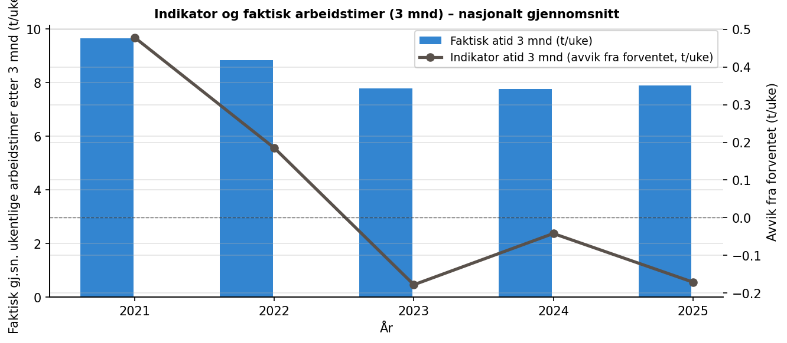
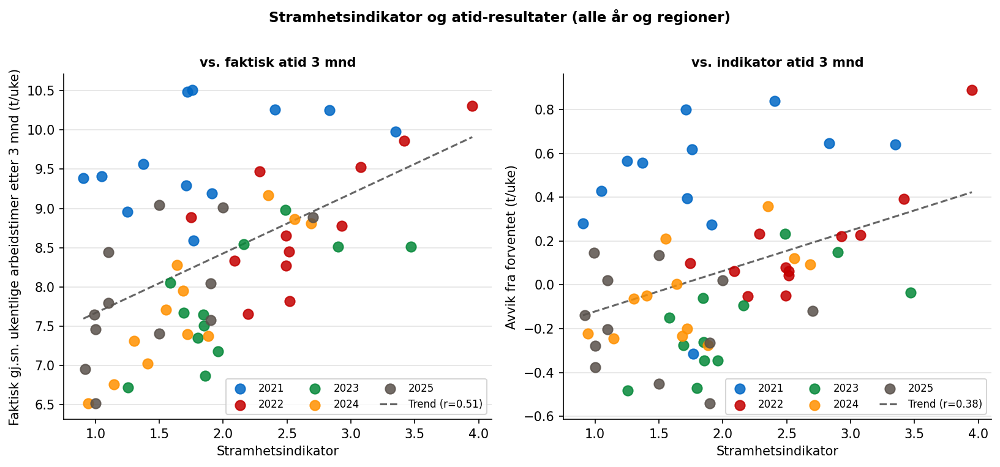
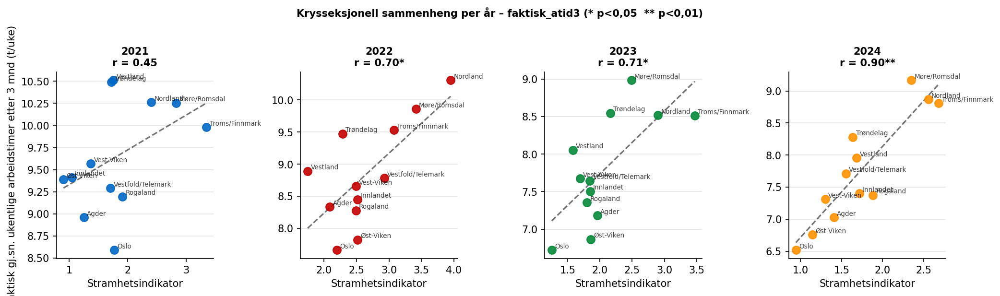
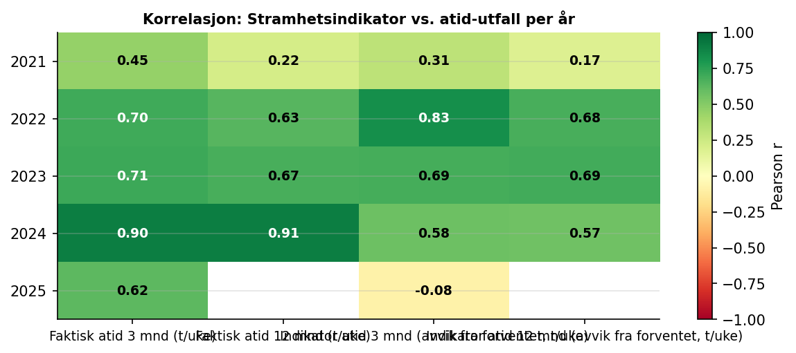
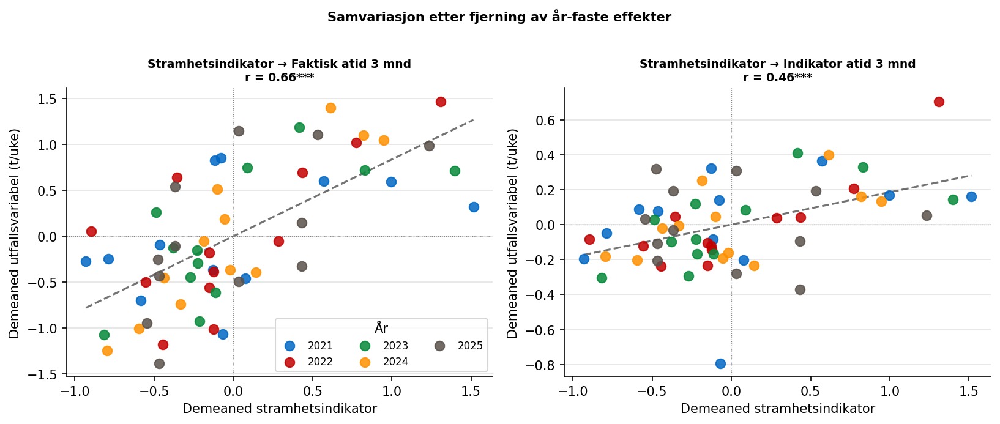

```{python}
import pandas as pd
```

# Data

## NAVs arbeidstidsindikator 2021–2025

Indikatordata er hentet fra NAVs BigQuery-tjeneste og inneholder månedlige
observasjoner per Nav-region. Vi bruker fire utfallsmål for arbeidstid:

| Variabel | Beskrivelse |
|---|---|
| `faktisk_atid3` | Gj.sn. ukentlige arbeidstimer i løpet av 3 mnd etter registrering (t/uke) |
| `faktisk_atid12` | Gj.sn. ukentlige arbeidstimer i løpet av 12 mnd etter registrering (t/uke) |
| `indikator_atid3` | Avvik fra *forventet* atid3 – kontrollerer for sammensetning (t/uke) |
| `indikator_atid12` | Avvik fra *forventet* atid12 (timer/uke) |

: Variabler fra arbeidstidsindikatoren brukt i analysen {#tbl-indvar}

Et positivt `indikator`-tall betyr at regionen gjør det *bedre enn forventet*
gitt sammensetningen av registrerte arbeidssøkere. Dette er det reneste
utfallsmålet for sammenligning mellom regioner, fordi det kontrollerer for
at noen regioner strukturelt sett har en mer krevende søkerpopulasjon.

*Merknad:* `faktisk_atid12` mangler for 2025 fordi 12-månedersutfallet for
arbeidssøkere registrert i mars 2025 ikke vil foreligge før mars 2026.

# Metode

## Korrelasjonsanalyse

Sammenhengen mellom bedrifts- og indikatorvariabler analyseres på to måter:

**Krysseksjonell analyse innen hvert år** sammenligner de tolv Nav-regionene
i samme undersøkelsesår. Denne tilnærmingen eliminerer nasjonale
konjunkturbevegelser og isolerer den *regionale* variasjonen i
arbeidsmarkedsstramhet.

**Pooled panel med år-faste effekter** demeaner alle variabler (trekker fra
årsgjennomsnitt) før korrelasjon beregnes på poolet datasett. Dette er
ekvivalent med en OLS-regresjon med år-dummyer og gir en robust
sammenstilling på tvers av alle år og regioner.

# Resultater

## Nasjonal utvikling i arbeidstidsindikator

{#fig-ind-tid}

@fig-ind-tid viser utviklingen i gjennomsnittlig ukentlig arbeidstid 3 måneder
etter registrering, og avviket fra forventet arbeidstid. Mønsteret ligner
jobbindikatoren: sammensetningseffekter gjør at faktisk arbeidstid kan bevege
seg mot strømmens av stramheten, mens indikatorvariabelen (avvik fra forventet)
gir et renere bilde av om regionene leverer mer eller mindre enn ventet.

## Sammenheng mellom stramhet og arbeidstidsutfall

{#fig-scatter-all}

{#fig-scatter-years}

@fig-scatter-all og @fig-scatter-years viser den positive sammenhengen
mellom stramhetsindikator og faktisk arbeidstid etter 3 måneder. Sammenhengen
er svak i 2021 (r = 0,45) men styrkes markant fra 2022 og utover, med
r = 0,70–0,90 i 2022–2024. Mønsteret er svært likt det som ble funnet
for jobbindikatoren, noe som tyder på at begge utfallsmål fanger opp den
samme underliggende mekanismen: i strammere markeder jobber nyregistrerte
arbeidssøkere mer timer per uke.

## Korrelasjonstabeller

```{python}
#| label: tbl-kor-per-aar
#| tbl-cap: "Pearson r mellom stramhetsindikator og atid-utfall per år (krysseksjonell). * p < 0,05"
pd.read_csv("tabeller/tbl_kor_per_aar.csv").set_index("År").style
```

```{python}
#| label: tbl-kor-pooled
#| tbl-cap: "Pooled Pearson r med år-faste effekter. * p<0,05  ** p<0,01  *** p<0,001"
pd.read_csv("tabeller/tbl_kor_pooled.csv").style.hide(axis="index")
```

{#fig-kor-heat}

@tbl-kor-per-aar viser at stramhetsindikatorens korrelasjon med faktisk
arbeidstid er konsistent positiv og statistisk signifikant fra 2022 og utover.
@tbl-kor-pooled viser at det samme holder i den poolede analysen med år-faste
effekter: stramhetsindikator er signifikant korrelert med `faktisk_atid3`
(r = 0,66, p < 0,001) og `faktisk_atid12` (r = 0,61, p < 0,001), og
indikatoravvikene `indikator_atid3` (r = 0,46, p < 0,001) og
`indikator_atid12` (r = 0,51, p < 0,001) er begge sterkt signifikante.
Sammenhengen for arbeidstid er noe sterkere enn for jobbindikatoravviket.

## Samvariasjon etter fjerning av år-effekter

{#fig-demeaned}

@fig-demeaned bekrefter at sammenhengen holder selv etter at nasjonale
konjunktursykluser er trukket ut: regioner som ligger *over* gjennomsnittet
i stramhet det aktuelle året, tenderer til å ha arbeidssøkere som arbeider
*flere timer per uke* enn gjennomsnittet det samme året.

# Konklusjon

Analysen dokumenterer en statistisk signifikant og substansiell positiv
sammenheng mellom bedriftsundersøkelsens stramhetsmål og arbeidstidsutfallene
for arbeidssøkere i NAV. Hovedfunnene er:

1. **Sterk krysseksjonell sammenheng:** Regioner med høy stramhetsindikator
   har arbeidssøkere som jobber markant flere timer per uke – innen samme år
   er r = 0,70–0,90 for faktisk arbeidstid 3 mnd (2022–2024).

2. **Sammenhengen holder med år-faste effekter:** Etter at nasjonale
   konjunkturbevegelser er fjernet (demeaning), forblir Pearson r = 0,66
   (p < 0,001) for faktisk arbeidstid 3 mnd og r = 0,46 (p < 0,001) for
   avviket fra forventet utfall (`indikator_atid3`).

3. **Sterkere signal enn jobbindikatoren:** Korrelasjonskoeffisientene for
   atid (arbeidstid) er gjennomgående høyere enn de tilsvarende for
   jobbindikatoren. En mulig forklaring er at arbeidstid er et mer
   kontinuerlig og sensitivt mål som fanger opp gradvise endringer i
   arbeidsmarkedstilpasningen.

4. **Svakt signal i 2021:** Sammenhengen er svakest det første analyseåret,
   trolig pga. koronapandemiens ettereffekter der mange permitterte gikk
   tilbake til opprinnelig arbeidsgiver – med fullt timetall – uavhengig av
   regional stramhet.

5. **Indikator-variabelen anbefales som primærmål:** `indikator_atid3`
   og `indikator_atid12` kontrollerer for at noen regioner strukturelt sett
   har en mer krevende søkerpopulasjon og gir dermed mer robuste komparative
   mål.

**Videre arbeid:**

- OLS-regresjon med region-klynge-robuste standardfeil på de demeaned
  variablene vil gi koeffisienter (timer/uke per enhet stramhet).
- Forsinkede effekter bør undersøkes: påvirker arbeidsmarkedsstramhet
  *om våren* arbeidstidsutfallene *om høsten* eller neste vår?
- Sammenligning av atid- og jobbindikatoren i en felles modell for å
  forstå hvilken dimensjon av arbeidstilpasningen stramhet påvirker mest.
