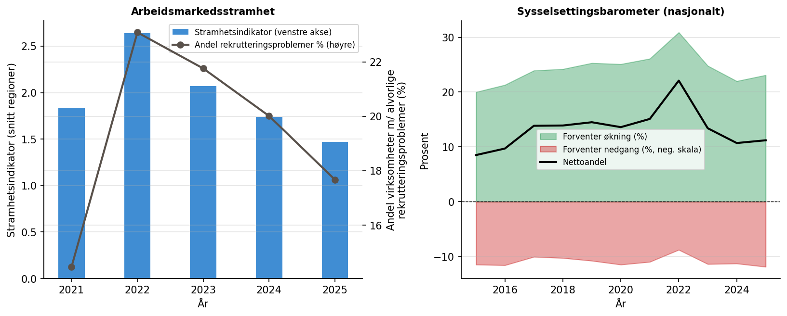
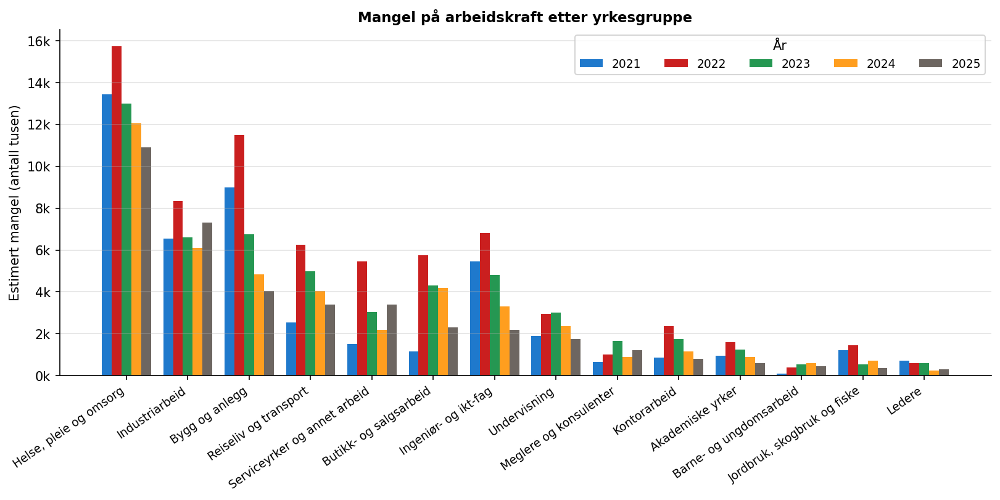
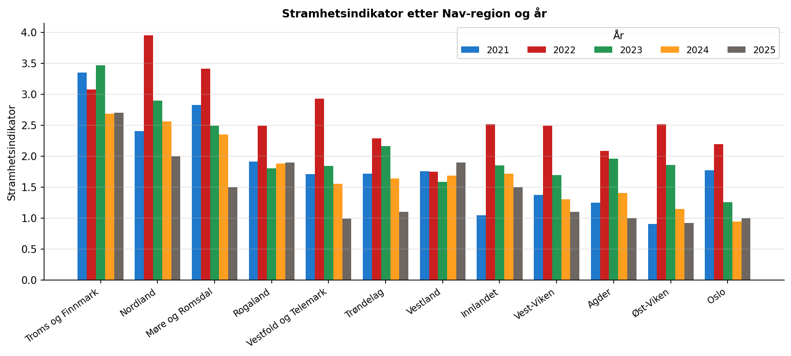

```{python}
import pandas as pd
```

# Bakgrunn

NAV produserer to komplementære informasjonskilder om det norske arbeidsmarkedet:

**Bedriftsundersøkelsen** er en årlig spørreundersøkelse der et representativt
utvalg norske virksomheter rapporterer om sin rekrutteringssituasjon, forventede
sysselsettingsutvikling og mangel på arbeidskraft. Undersøkelsen gjennomføres
hvert vår og gir et bilde av *etterspørselssiden* av arbeidsmarkedet.

**Navs arbeidsindikator** er månedlige statistikker som måler *resultater for
registrerte arbeidssøkere* – andelen som har kommet i arbeid, og gjennomsnittlig
ukentlig arbeidstid, etter henholdsvis 3 og 12 måneder. Indikatoren beregnes
som faktisk utfall minus et forventet utfall basert på søkernes sammensetning
(alder, yrkesbakgrunn m.m.), og publiseres på Nav-regionsnivå.

Målet med disse analysene er å undersøke om regionale forskjeller i
arbeidsmarkedsstramhet – slik bedriftsundersøkelsen måler det – samvarierer
med utfall for arbeidssøkere slik indikatorene måler det.

# Data

## Bedriftsundersøkelsen 2021–2025

Dataene er hentet fra NAVs nettside og dekker årene 2021–2025. Fra
undersøkelsen bruker vi følgende regionale variable:

| Variabel | Beskrivelse |
|---|---|
| **Stramhetsindikator** | Forholdet mellom estimert mangel på arbeidskraft og antall ledige + arbeidssøkere på tiltak; høy verdi = stramt marked |
| **Andel rekrutteringsproblemer** | Andel virksomheter som rapporterer *alvorlige* rekrutteringsproblemer (prosent) |
| **Estimert mangel** | Antall stillinger arbeidsgivere ikke klarer å besette |
| **Sysselsettingsbarometer** | Nettoandelvirksomheter som venter økt minus redusert sysselsetting (nasjonal tidsserie fra 2003) |

: Variabler fra bedriftsundersøkelsen brukt i analysen {#tbl-bedriftsvar}

**Geografisk endring:** Undersøkelsen brukte store Nav-regioner (Øst-Viken,
Vest-Viken osv.) i 2021–2023, og gikk over til individuelle fylker fra 2024.
Dataene for 2024–2025 er aggregert tilbake til Nav-regionsnivå: summable
størrelser (mangel, konfidensintervaller) er summert, mens rater
(stramhetsindikator, rekrutteringsproblemer) er vektet med estimert mangel.

## Datasett etter standardisering

```{python}
#| label: tbl-oversikt
#| tbl-cap: "Antall Nav-regioner per år"
(
    pd.read_csv("tabeller/tbl_oversikt.csv")
    .set_index("År")
    .style
)
```

## Geografisk mapping

```{python}
#| label: tbl-geomap
#| tbl-cap: "Mapping fra undersøkelsens enheter til Nav-regioner"
pd.read_csv("tabeller/tbl_geomap.csv").style.hide(axis="index")
```

# Metode

## Temporal standardisering

For å sammenstille bedriftsundersøkelsen med indikatordata er indikatordata
filtrert til den referansemåneden bedriftsundersøkelsen bruker for hvert år:

| År | Referansemåned | Begrunnelse |
|---|---|---|
| 2021 | Februar | Oppgitt i tabelltittel i Excel-filen |
| 2022 | April | Oppgitt i tabelltittel |
| 2023 | April | Oppgitt i tabelltittel |
| 2024 | Mars | Oppgitt i tabelltittel |
| 2025 | Mars | Oppgitt i tabelltittel |

: Valgte referansemåneder for indikatordata per undersøkelsesår {#tbl-refmnd}

# Resultater

## Nasjonal utvikling 2021–2025

{#fig-nasjonal}

@fig-nasjonal viser et tydelig mønster over perioden:

- **2021:** Arbeidsmarkedet var fremdeles preget av koronapandemien. NAVs
  rapport for 2021 hadde tittelen *«Nedbemanning og lavere mangel på
  arbeidskraft under koronakrisen»*. Total estimert mangel var 46 000 personer
  – 13 450 lavere enn rekordnivået i 2019. Overnattings- og
  serveringsbransjen ble hardest rammet av permitteringer, mens helse og
  undervisning oppbemannet som følge av pandemien.

- **2022:** Stramheten nådde rekordnivå med stramhetsindikator 2,64 og
  23 % av virksomhetene med alvorlige rekrutteringsproblemer – det høyeste
  siden 2008. Estimert mangel steg til 70 250 personer, hele 24 250 flere enn
  i 2021. Sysselsettingsbarometeret lå på 22 pp – den høyeste forventningen om
  sysselsettingsvekst siden 2008.

- **2023–2024:** Stramheten falt etter hvert som rentehevinger og svakere
  konjunktur dempet etterspørselen. Mangelen gikk ned til 52 850 (2023) og
  43 600 (2024). Sysselsettingsforventningene falt til 13 pp (2023) og
  11 pp (2024).

- **2025:** Stramhetsindikator 1,47 og mangel på 39 000 personer. Temaet
  for 2025-rapporten er *«Stor mangel på folk med fagbrev»* – for første gang
  kartlegges mangel etter utdanningsbakgrunn. Et nettoandel på 11 pp i
  sysselsettingsbarometeret er historisk lavt: siden 2003 er et tilsvarende
  nivå bare observert under lavkonjunkturen i 2003, finanskrisen i 2009–2010
  og den oljerelaterte nedgangen i 2014–2016.

| År | Estimert total mangel | Tema i NAV-rapporten |
|---|---|---|
| 2021 | 46 000 | Nedbemanning og lavere mangel – koronaeffekter |
| 2022 | 70 250 | Stor mangel – rekord siden 2008 |
| 2023 | 52 850 | Redusert mangel på arbeidskraft |
| 2024 | 43 600 | Redusert mangel på arbeidskraft |
| 2025 | 39 000 | Stor mangel på folk med fagbrev |

: Total estimert mangel på arbeidskraft per år (NAVs bedriftsundersøkelse) {#tbl-mangel-trend}

## Mangel på arbeidskraft etter yrkesgruppe

{#fig-yrke}

@fig-yrke illustrerer at mangelen er klart størst innen **helse, pleie og
omsorg** hvert eneste år. Mangelen i denne yrkesgruppen nådde toppen i 2022
(≈15 750 personer) og er fremdeles betydelig i 2025 (≈10 900 etter
yrkesgruppedata; noe høyere etter sektordata pga. dekningsproblemer i
kommunale helsetjenester i 2025-utvalget). Industriarbeid og bygg og anlegg
utgjør de nest største kategoriene.

I 2025 kartlegges for første gang mangel etter utdanningsbakgrunn: mangelen
er størst for **videregående fag- og yrkesopplæring**, særlig mekaniske fag
og maskinfag (4 050 personer), bygg- og anleggsfag (2 450) og elektrofag
(1 800). Dette indikerer et strukturelt kompetansemismatch der etterspørselen
etter fagarbeidere er høyere enn tilgangen.

## Regional variasjon i stramhet

{#fig-regional}

Troms og Finnmark, Nordland og Møre og Romsdal har konsistent de høyeste
stramhetsindikatorene. I 2021 påpeker NAV-rapporten at Møre og Romsdal og
Vestland hadde høyest andel virksomheter med alvorlige rekrutteringsproblemer,
mens Agder hadde lavest. I 2022 toppet Nordland og Møre og Romsdal
rekrutteringsutfordringene. Dette gjenspeiler en kombinasjon av høy etterspørsel
etter spesialisert arbeidskraft og et tynnere lokalt tilbudsmarked i nord og vest.
Oslo og Vest-Viken har relativt lavere indikatorer.
