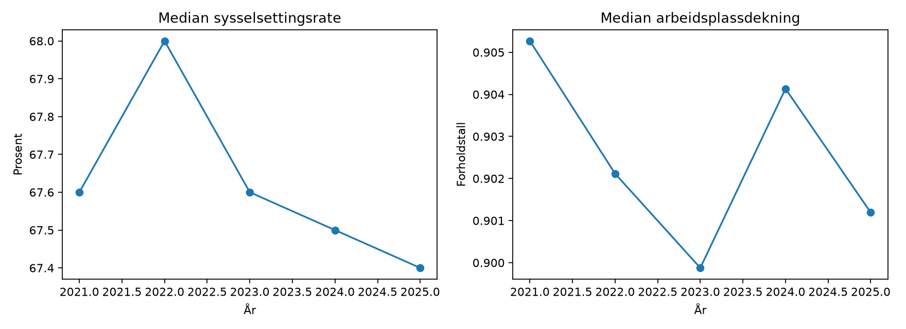
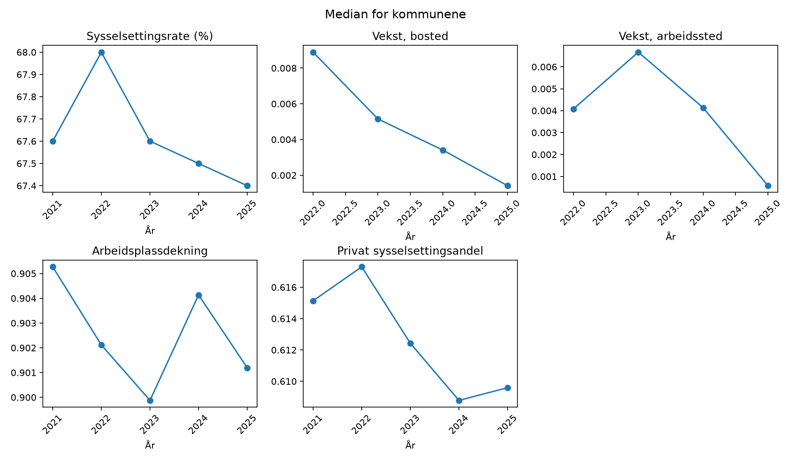
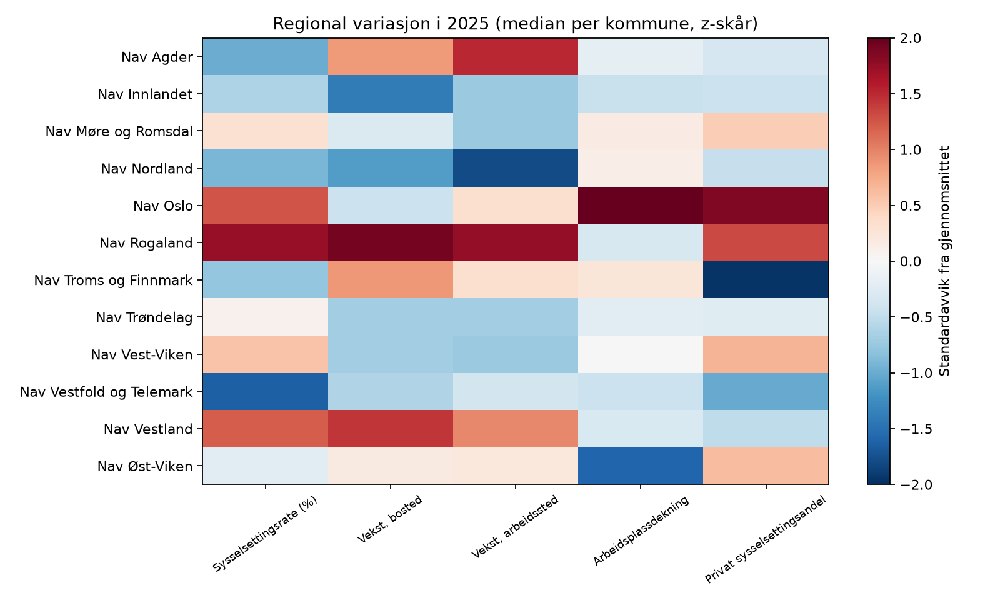

De fem målene nedenfor er et **datagrunnlag for senere analyser**. De inngår
ikke i analysene ellers i rapporten. SSB publiserer de mest detaljerte
kommunevise registerdataene som årstall per fjerde kvartal. Det finnes ikke
tilsvarende månedlige eller kvartalsvise serier på kommunenivå for 2021--2025,
så årsverdiene er beholdt uten interpolering.

NAVs arbeidsindikator hentes og standardiseres separat på sitt laveste
tilgjengelige nivå: én observasjon per NAV-kontor og måned. Dette gir et
office-month-panel med faktisk, forventet og indikatorverdi for hvert av de
fire utfallene. SSB-målene nedenfor beholdes på kommunenivå og kobles til
NAV-region for å unngå å fordele kommuneverdier kunstig mellom kontorer.

| Mål | Konstruksjon | Kilde og oppløsning |
|---|---|---|
| Sysselsettingsrate | Sysselsatte 15--74 år som andel av befolkningen | SSB [06445](https://www.ssb.no/statbank/table/06445/), kommune, 4. kvartal |
| Vekst, bosted | Årlig endring i sysselsatte etter bosted | SSB [07984](https://www.ssb.no/statbank/table/07984/), kommune, 4. kvartal |
| Vekst, arbeidssted | Årlig endring i sysselsatte etter arbeidssted | SSB [07984](https://www.ssb.no/statbank/table/07984/), kommune, 4. kvartal |
| Arbeidsplassdekning | Sysselsatte etter arbeidssted / bosted | SSB 07984, kommune, 4. kvartal |
| Privat sysselsettingsandel | Privat sysselsetting etter arbeidssted / samlet sysselsetting | SSB [13472](https://www.ssb.no/statbank/table/13472/), kommune, 4. kvartal |

Kommunene kobles til NAV-region ved den vedlikeholdte kommune--kontor--fylke-
mappingen. De opprinnelige kommuneobservasjonene beholdes i det standardiserte
datasettet; dette er den fineste felles geografien for disse målene.

```{python}
import pandas as pd
pd.read_csv("tabeller/arbeidsmarkedsmaal_dekning.csv").style.hide(axis="index")
```



## Utvikling i kommunene



## Regional variasjon

Figuren viser hvert NAV-områdes median kommuneverdi. Verdiene er standardisert
innen mål for å kunne vise geografiske forskjeller på tvers av ulike enheter.


