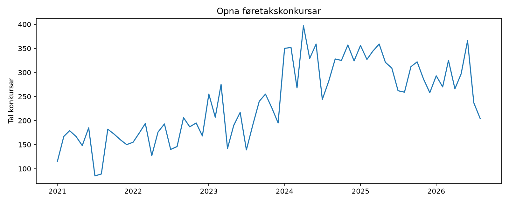
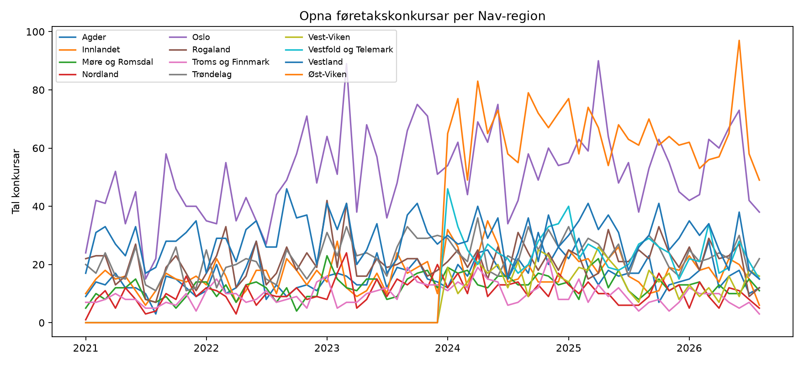
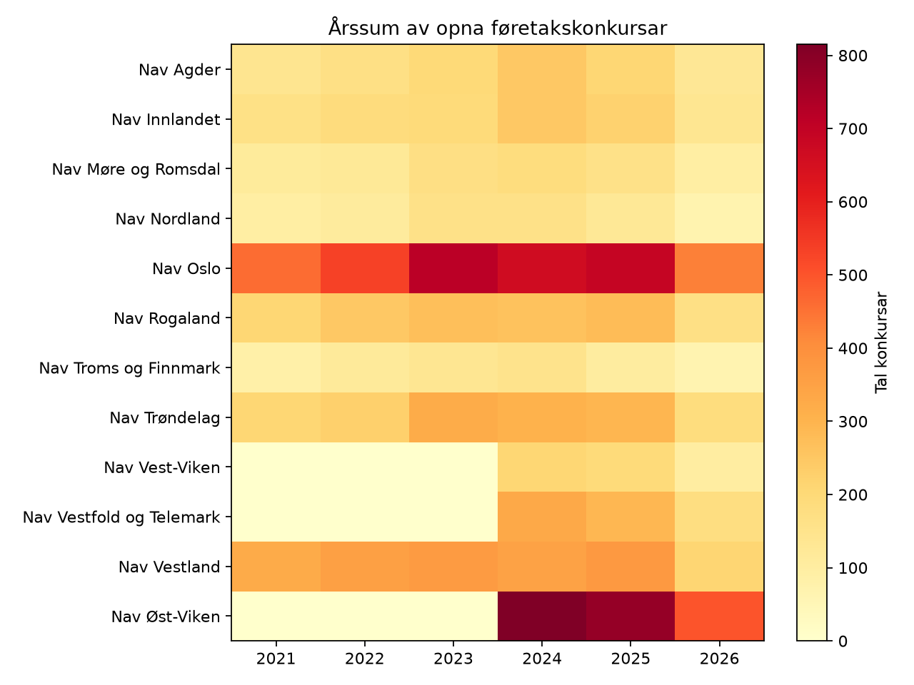

SSB [tabell 08551](https://www.ssb.no/statbank/table/08551/) gir **månedlige**
tal for opna konkursar. Datagrunnlaget bruker føretakskonkursar, ekskludert
einskildpersonføretak, for alle næringar. Serien er tilgjengelig på fylkesnivå,
som er den fineste tilgjengelige geografien i tabellen.

Fylka er koblet til NAV-regionene med den samme geografi-mappingen som resten
av datagrunnlaget. Fylkesverdiene beholdes, mens NAV-regionens verdi er summen
av fylkene i regionen. For 2021--2023 publiseres Viken bare samlet; den kan
ikke fordeles valid mellom Nav Øst-Viken og Nav Vest-Viken og beholdes derfor
bare i fylkespanelet. Serien brukes foreløpig bare som beskrivende
datagrunnlag, ikke som forklaringsvariabel i rapportens analyser.

```{python}
import pandas as pd
pd.read_csv("tabeller/konkurser_dekning.csv").style.hide(axis="index")
```



## Regional utvikling



## Årlig regional variasjon


