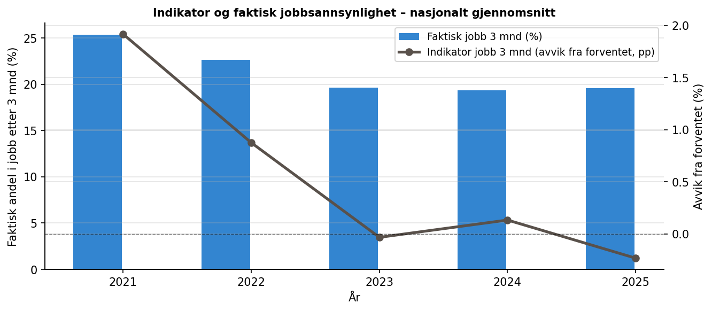
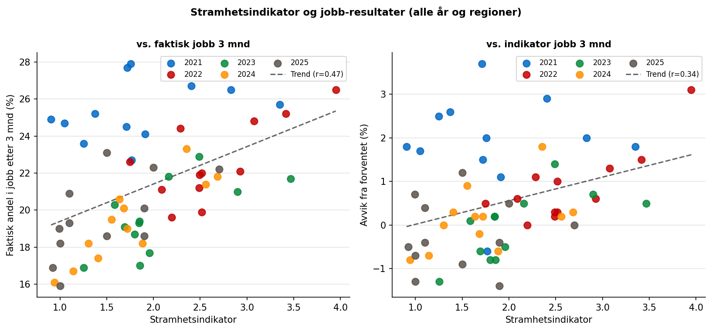
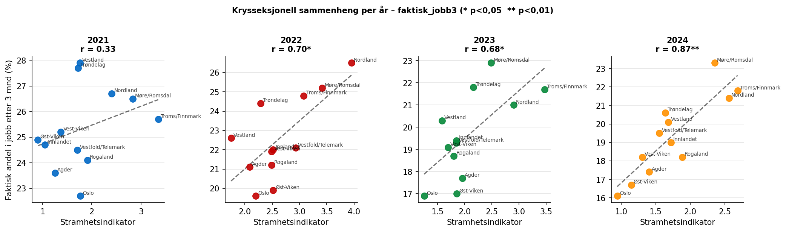
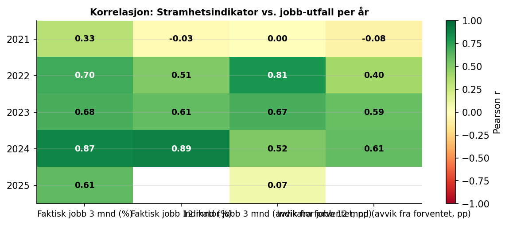
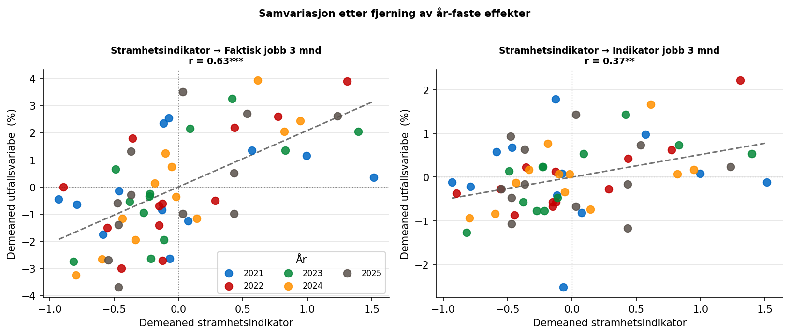

```{python}
import pandas as pd
```

# Bakgrunn

NAV produserer to komplementære informasjonskilder om det norske arbeidsmarkedet:

**Bedriftsundersøkelsen** er en årlig spørreundersøkelse der et representativt
utvalg norske virksomheter rapporterer om sin rekrutteringssituasjon, forventede
sysselsettingsutvikling og mangel på arbeidskraft. Undersøkelsen gjennomføres
hvert vår og gir et bilde av *etterspørselssiden* av arbeidsmarkedet.

**Navs arbeidsindikator** er månedlige statistikker som måler *resultater for
registrerte arbeidssøkere* – i første rekke andelen som har kommet i arbeid
etter henholdsvis 3 og 12 måneder. Indikatoren beregnes som faktisk utfall
minus et forventet utfall basert på søkernes sammensetning (alder,
yrkesbakgrunn m.m.), og publiseres på Nav-regionsnivå.

Målet med denne analysen er å undersøke om regionale forskjeller i
arbeidsmarkedsstramhet – slik bedriftsundersøkelsen måler det – samvarierer
med utfall for arbeidssøkere slik indikatorene måler det.

# Data

## Bedriftsundersøkelsen 2021–2025

Dataene er hentet fra NAVs nettside og dekker årene 2021–2025. Fra
undersøkelsen bruker vi følgende regionale variable:

| Variabel | Beskrivelse |
|---|---|
| **Stramhetsindikator** | Forholdet mellom estimert mangel på arbeidskraft og antall ledige + arbeidssøkere på tiltak; høy verdi = stramt marked |
| **Andel rekrutteringsproblemer** | Andel virksomheter som rapporterer *alvorlige* rekrutteringsproblemer (prosent) |
| **Estimert mangel** | Antall stillinger arbeidsgivere ikke klarer å besette |
| **Sysselsettingsbarometer** | Nettoandelvirksomheter som venter økt minus redusert sysselsetting (nasjonal tidsserie fra 2003) |

: Variabler fra bedriftsundersøkelsen brukt i analysen {#tbl-bedriftsvar}

**Geografisk endring:** Undersøkelsen brukte store Nav-regioner (Øst-Viken,
Vest-Viken osv.) i 2021–2023, og gikk over til individuelle fylker fra 2024.
Dataene for 2024–2025 er aggregert tilbake til Nav-regionsnivå: summable
størrelser (mangel, konfidensintervaller) er summert, mens rater
(stramhetsindikator, rekrutteringsproblemer) er vektet med estimert mangel.

## NAVs arbeidsindikator 2021–2025

Indikatordata er hentet fra NAVs BigQuery-tjeneste og inneholder månedlige
observasjoner per Nav-region. Vi bruker fire utfallsmål:

| Variabel | Beskrivelse |
|---|---|
| `faktisk_jobb3` | Andel registrert den aktuelle måneden som var i jobb etter 3 måneder (%) |
| `faktisk_jobb12` | Andel registrert den aktuelle måneden som var i jobb etter 12 måneder (%) |
| `indikator_jobb3` | Avvik fra *forventet* jobb3 – kontrollerer for sammensetning (pp) |
| `indikator_jobb12` | Avvik fra *forventet* jobb12 (prosentpoeng) |

: Variabler fra arbeidsindikatorene brukt i analysen {#tbl-indvar}

Et positivt `indikator`-tall betyr at regionen gjør det *bedre enn forventet*
gitt sammensetningen av registrerte arbeidssøkere. Dette er det reneste
utfallsmålet for sammenligning mellom regioner, fordi det kontrollerer for
at noen regioner strukturelt sett har en mer krevende søkerpopulasjon.

## Datasett etter standardisering

```{python}
#| label: tbl-oversikt
#| tbl-cap: "Antall Nav-regioner og komplette observasjoner per år"
(
    pd.read_csv("tabeller/tbl_oversikt.csv")
    .set_index("År")
    .style
)
```

*Merknad:* `faktisk_jobb12` mangler for 2025 fordi 12-månedersutfallet for
arbeidssøkere registrert i mars 2025 ikke vil foreligge før mars 2026.

## Geografisk mapping

```{python}
#| label: tbl-geomap
#| tbl-cap: "Mapping fra undersøkelsens enheter til Nav-regioner"
pd.read_csv("tabeller/tbl_geomap.csv").style.hide(axis="index")
```

# Metode

## Temporal standardisering

For å sammenstille de to datakildene er indikatordata filtrert til den
referansemåneden bedriftsundersøkelsen bruker for hvert år:

| År | Referansemåned | Begrunnelse |
|---|---|---|
| 2021 | Februar | Oppgitt i tabelltittel i Excel-filen |
| 2022 | April | Oppgitt i tabelltittel |
| 2023 | April | Oppgitt i tabelltittel |
| 2024 | Mars | Oppgitt i tabelltittel |
| 2025 | Mars | Oppgitt i tabelltittel |

: Valgte referansemåneder for indikatordata per undersøkelsesår {#tbl-refmnd}

## Korrelasjonsanalyse

Sammenhengen mellom bedrifts- og indikatorvariabler analyseres på to måter:

**Krysseksjonell analyse innen hvert år** sammenligner de tolv Nav-regionene
i samme undersøkelsesår. Denne tilnærmingen eliminerer nasjonale
konjunkturbevegelser – det at alle regioner stiger og faller simultant –
og isolerer den *regionale* variasjonen i arbeidsmarkedsstramhet.

**Pooled panel med år-faste effekter** demeaner alle variabler (trekker fra
årsgjennomsnitt) før korrelasjon beregnes på poolet datasett. Dette er
ekvivalent med en OLS-regresjon med år-dummyer og gir en robust
sammenstilling på tvers av alle år og regioner.

# Resultater

## Nasjonal utvikling 2021–2025

{#fig-nasjonal}

@fig-nasjonal viser at arbeidsmarkedet var klart strammest i 2022, med en
gjennomsnittlig stramhetsindikator på 2,6 og nær 23 % av virksomhetene med
alvorlige rekrutteringsproblemer. Deretter har stramheten falt gradvis til
1,5 i 2025. Sysselsettingsbarometeret bekrefter dette bildet: nettoandelen
som venter økt sysselsetting nådde toppen i 2022 (22 pp), men har
normalisert seg mot historisk gjennomsnitt i 2023–2025.

{#fig-ind-tid}

@fig-ind-tid viser at både det faktiske og det justerte jobbresultatet falt
markant fra 2021 til 2023 – til tross for at arbeidsmarkedet var stramt.
Dette reflekterer sammensetningseffekter: i 2021 gikk mange koronaiserte
permitterte raskt tilbake til sin opprinnelige arbeidsgiver, mens de
gjenværende registrerte i 2022–2023 utgjorde en mer krevende gruppe. Det er
nettopp derfor *indikatorvariabelen* (avvik fra forventet) er det relevante
sammenligningsmålet.

## Mangel på arbeidskraft etter yrkesgruppe

{#fig-yrke}

@fig-yrke illustrerer at mangelen er klart størst innen **helse, pleie og
omsorg** hvert eneste år. Mangelen nådde toppen i 2022 (≈15 750 personer)
og er fremdeles betydelig i 2025 (≈10 900). Industriarbeid og bygg og
anlegg utgjør de nest største kategoriene.

## Regional variasjon i stramhet

{#fig-regional}

Troms og Finnmark, Nordland og Møre og Romsdal har konsistent de høyeste
stramhetsindikatorene. Det gjenspeiler en kombinasjon av høy etterspørsel
etter spesialisert arbeidskraft og et tynnere lokalt tilbudsmarked.
Oslo og Vest-Viken har relativt lavere indikatorer.

## Sammenheng mellom stramhet og indikatorutfall

{#fig-scatter-all}

{#fig-scatter-years}

@fig-scatter-all og @fig-scatter-years viser den positive sammenhengen
mellom stramhetsindikator og faktisk jobbplassering. Sammenhengen er svak i
2021 (r = 0,33) men styrkes markant i 2022–2024 der r er 0,70–0,87. En
mulig tolkning er at koronapandemiens ettereffekter forstyrret signalet i
2021 – mange permitterte gikk tilbake til sin opprinnelige arbeidsgiver
uavhengig av regional stramhet.

## Korrelasjonstabeller

```{python}
#| label: tbl-kor-per-aar
#| tbl-cap: "Pearson r mellom stramhetsindikator og indikatorutfall per år (krysseksjonell). * p < 0,05"
pd.read_csv("tabeller/tbl_kor_per_aar.csv").set_index("År").style
```

```{python}
#| label: tbl-kor-pooled
#| tbl-cap: "Pooled Pearson r med år-faste effekter. * p<0,05  ** p<0,01  *** p<0,001"
pd.read_csv("tabeller/tbl_kor_pooled.csv").style.hide(axis="index")
```

{#fig-kor-heat}

@tbl-kor-per-aar viser at stramhetsindikatorens korrelasjon med faktisk
jobbplassering er konsistent positiv og statistisk signifikant fra 2022 og
utover. @tbl-kor-pooled viser at det samme holder i den poolede analysen
med år-faste effekter: stramhetsindikator er signifikant korrelert med
`faktisk_jobb3` (r = 0,63, p < 0,001) og `faktisk_jobb12`
(r = 0,46, p < 0,01) etter at nasjonale trender er fjernet.

## Samvariasjon etter fjerning av år-effekter

{#fig-demeaned}

@fig-demeaned bekrefter at sammenhengen holder selv etter at nasjonale
konjunktursykluser er trukket ut: regioner som ligger *over* gjennomsnittet
i stramhet det aktuelle året, tenderer til å plassere *flere* arbeidssøkere
i jobb enn gjennomsnittet det samme året.

# Konklusjon

Analysen dokumenterer en statistisk signifikant og substansiell positiv
sammenheng mellom bedriftsundersøkelsens stramhetsmål og indikatorutfallene
for arbeidssøkere i NAV. Hovedfunnene er:

1. **Sterk krysseksjonell sammenheng:** Regioner med høy stramhetsindikator
   plasserer markant flere arbeidssøkere i jobb enn regioner med lav
   stramhet – innen samme år er r = 0,70–0,89 for faktisk jobbsannsynlighet
   (2022–2024).

2. **Sammenhengen holder med år-faste effekter:** Etter at nasjonale
   konjunkturbevegelser er fjernet (demeaning), forblir Pearson r = 0,63
   (p < 0,001) for faktisk jobb 3 mnd, og r = 0,37 (p < 0,01) for avviket
   fra forventet utfall (`indikator_jobb3`).

3. **Svakt signal i 2021:** Sammenhengen er svak det første analyseåret,
   trolig fordi permitterte arbeidstakere gikk tilbake til sine
   opprinnelige arbeidsgivere uavhengig av regional stramhet etter pandemien.

4. **Indikator-variabelen anbefales som primærmål:** `indikator_jobb3`
   og `indikator_jobb12` (avvik fra forventet) er renere mål fordi de
   kontrollerer for at noen regioner strukturelt sett har en mer krevende
   søkerpopulasjon.

5. **Helse og omsorg dominerer mangelen:** Uavhengig av år er mangelen
   størst innen helse, pleie og omsorg – en sektor der økt stramhet
   paradoksalt ikke nødvendigvis hjelper plassering av arbeidssøkere,
   fordi behovene er svært kompetansespesifikke.

**Videre arbeid:**

- OLS-regresjon med region-klynge-robuste standardfeil på de demeaned
  variablene vil gi koeffisienter i stedet for r-verdier.
- Forsinkede effekter bør undersøkes: påvirker arbeidsmarkedsstramhet
  *om våren* indikatorutfallene *om høsten* eller neste vår?
- Bransjenivå-analyse: sammenhengen mellom næringsvise mangeltall og
  indikatorutfall for arbeidssøkere med bakgrunn i de aktuelle næringene.
