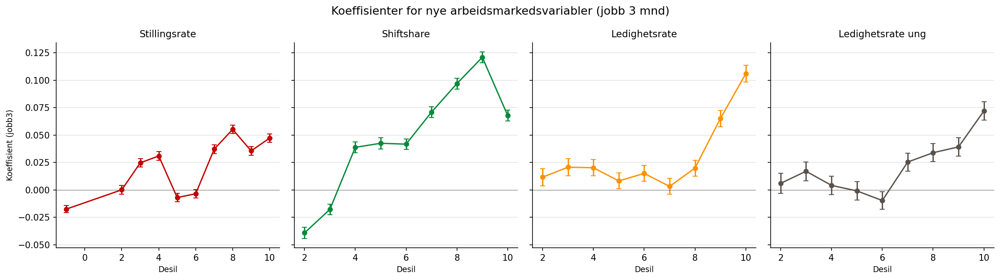

```{python}
import pandas as pd
```

# Modelloversikt

Vi sammenligner fem modellvarianter som alle estimerer forventet utfall for
arbeidssøkere, men med ulike arbeidsmarkedskontroller:

```{python}
#| label: tbl-modelloversikt
#| tbl-cap: "Oversikt over modellvarianter"
df = pd.read_csv("tabeller/modelloversikt.csv")
df[["Modell", "Ekstra LM-variabel", "Beskrivelse"]]
```

Alle modeller er estimert på bo- og arbeidsmarkedsregioner (160 regioner i
Norge), der arbeidsmarkedsvariablene er kategorisert i desiler. Referansemodellen
er den gjeldende produksjonsmodellen brukt i Navs arbeidsindikator.

# Koeffisienter for nye arbeidsmarkedsvariabler

@fig-koeff-desil viser koeffisientene for de nye arbeidsmarkedsvariablene
i de fire utvidede modellene, for utfallet *jobb 3 måneder*. Koeffisientene
viser effekten av å tilhøre et gitt desil relativt til referansedesilen
(desil 1). Feilstaver viser 95 % konfidensintervall.

{#fig-koeff-desil}

Et stigende mønster indikerer at høyere verdier på arbeidsmarkedsvariabelen
(f.eks. høyere stillingsrate eller lavere ledighetsrate) er assosiert med
bedre jobbresultat, selv etter kontroll for individuelle kjennetegn og
tilstrømming. Alle fire variabler viser generelt stigende koeffisienter
fra lave til høye desiler, med varierende grad av monotonitet.

# Stabilitet i tilstrømmingskoeffisienter

Et sentralt spørsmål er om de eksisterende tilstrømmingskoeffisientene
endres vesentlig når nye variabler legges til. Stor endring kan tyde på
at tilstrømmingsvariabelen i referansemodellen delvis fanger opp variasjonen
som de nye variablene er ment å måle.

```{python}
#| label: tbl-tilstromming-endring
#| tbl-cap: "Gjennomsnittlig absolutt endring i tilstrømmingskoeffisienter vs. referanse"
df_ts = pd.read_csv("../../data/results/modellendringer_tilstromming_endring.csv")
sammendrag = (
    df_ts[df_ts["result_id"] != 77]
    .groupby("modell")
    .agg(
        gj_sn_abs_endring=("koeff_endring", lambda x: x.abs().mean()),
        gj_sn_abs_endring_pst=("koeff_endring_pst", lambda x: x.abs().mean()),
    )
    .round(3)
    .reset_index()
)
sammendrag.columns = ["Modell", "Gj.sn. |endring|", "Gj.sn. |endring| (%)"]
sammendrag
```

Ledighetsrate-modellen viser størst endring i tilstrømmingskoeffisientene, noe
som tyder på at ledighetsrate og tilstrømming fanger mye av den samme
underliggende variasjonen i arbeidsmarkedet. Stillingsrate og shiftshare gir
mer moderate endringer.
