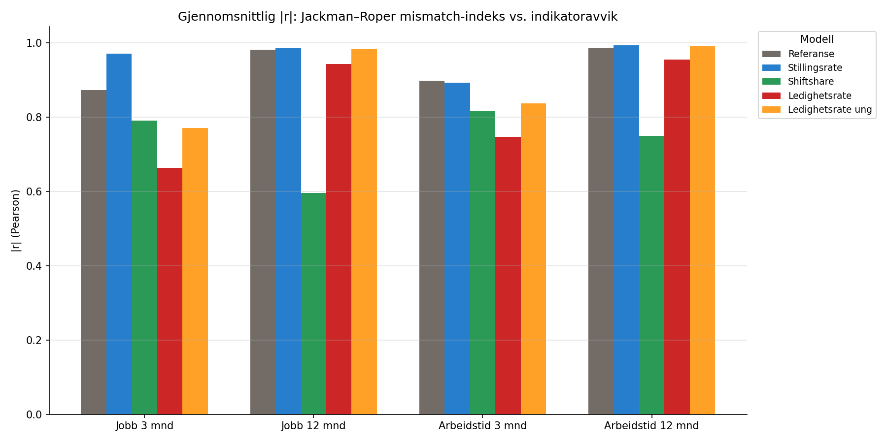

```{python}
import pandas as pd
```

# Motivasjon

Stramhetstesten viste at stillingsrate-modellen reduserer sammenhengen mellom
indikatoravvikene og arbeidsmarkedsstramhet, mens shiftshare og
ledighetsrate-modellene ikke gjør det. Vi stiller det tilsvarende spørsmålet
for et annet eksternt mål: **kompetansemismatch**.

Mismatch-indeksene er beregnet fra bedriftsundersøkelsens jobbmarked (JR) og
Cobb–Douglas-rammeverket (CD). De fanger opp ubalansen mellom tilgjengelig og
etterspurt kompetanse på tvers av yrker — et mål som er konseptuelt atskilt fra
stramhetsindikatorene, men som i stor grad avspeiler de samme
strukturelle trekkene i arbeidsmarkedet.

Dersom en modellvariant kontrollerer bedre for arbeidsmarkedet, bør
indikatoravvikene vise *svakere* korrelasjon med mismatch-indeksene.

::: {.callout-note}
## Merk: Datapunktene er svært få
Mismatch-data er kun tilgjengelig på årsplan fra bedriftsundersøkelsen
(2021–2025), noe som gir maksimalt fem datapunkter. Med dette utgangspunktet er
alle korrelasjoner statistisk svakt fundert — spesielt gjelder dette 12-månedersutfallene
der siste år mangler observasjoner.

Fra [sensitiv­itetstesten](../mismatch/sensitivitet.qmd) vet vi at korrelasjonen
mellom mismatch og indikator i all vesentlighet drives av én observasjon (2021,
pandemigjenopeningen). Resultatene her bør tolkes med tilsvarende forsiktighet.
:::

# Korrelasjoner per modell

For hvert år beregner vi årsgjennomsnitt av indikatoren (nasjonalt) per modell,
og korrelerer med de tilhørende mismatch-indeksene fra bedriftsundersøkelsen.

```{python}
#| label: tbl-mismatch-korr
#| tbl-cap: "Absolutt Pearson-korrelasjon mellom indikatoravvik og Jackman–Roper mismatch-indeks per modell"
df = pd.read_csv("../../data/results/modellendringer_mismatch_korrelasjoner.csv")

utfall_labels = {
    "jobb3": "Jobb 3 mnd",
    "jobb12": "Jobb 12 mnd",
    "atid3": "Atid 3 mnd",
    "atid12": "Atid 12 mnd",
}

modell_rekkefølge = ["Referanse", "Stillingsrate", "Shiftshare", "Ledighetsrate", "Ledighetsrate ung"]

sub = df[
    (df["mismatch_var"] == "mismatch_indeks")
    & (df["indikator_type"] == "indikator")
]

rows = []
for utfall in ["jobb3", "jobb12", "atid3", "atid12"]:
    usub = sub[sub["utfall"] == utfall]
    ref_r = usub[usub["modell"] == "Referanse"]["r_pearson"].abs().values
    if len(ref_r) == 0:
        continue
    ref_r = ref_r[0]
    for modell in modell_rekkefølge:
        msub = usub[usub["modell"] == modell]
        if msub.empty:
            continue
        r_val = msub["r_pearson"].abs().values[0]
        p_val = msub["p_pearson"].values[0]
        delta = ref_r - r_val
        sig = "***" if p_val < 0.001 else ("**" if p_val < 0.01 else ("*" if p_val < 0.05 else ""))
        rows.append({
            "Utfall": utfall_labels[utfall],
            "Modell": modell,
            "|r|": f"{r_val:.3f}{sig}",
            "|r|-endring": f"{delta:+.3f}" if modell != "Referanse" else "—",
        })

pd.DataFrame(rows)
```

{#fig-mismatch-korr}

@fig-mismatch-korr viser de absolutte Pearson-korrelasjonene mellom indikatoren
(avvikskomponenten) og Jackman–Roper mismatch-indeksen, per modell og utfall.

# Regresjon per modell

```{python}
#| label: tbl-mismatch-reg
#| tbl-cap: "OLS-regresjon: indikatoravvik ~ mismatch-indeks, med Newey–West standardfeil og måned-dummyer"
df_reg = pd.read_csv("../../data/results/modellendringer_mismatch_regresjon.csv")

sub_reg = df_reg[
    (df_reg["mismatch_var"] == "mismatch_indeks")
    & (df_reg["indikator_type"] == "indikator")
]

rows = []
for utfall in ["jobb3", "jobb12", "atid3", "atid12"]:
    usub = sub_reg[sub_reg["utfall"] == utfall]
    for modell in modell_rekkefølge:
        msub = usub[usub["modell"] == modell]
        if msub.empty:
            continue
        row = msub.iloc[0]
        sig = "***" if row["p_verdi"] < 0.001 else ("**" if row["p_verdi"] < 0.01 else ("*" if row["p_verdi"] < 0.05 else ""))
        rows.append({
            "Utfall": utfall_labels[utfall],
            "Modell": modell,
            "β": f"{row['beta_mismatch']:.4f}",
            "SE (NW)": f"{row['se_newey_west']:.4f}",
            "p-verdi": f"{row['p_verdi']:.4f}{sig}",
            "R² adj.": f"{row['r2_adj']:.3f}",
        })
pd.DataFrame(rows)
```

# Oppsummering

```{python}
#| label: tbl-mismatch-samm
#| tbl-cap: "Endring i |r| vs. referansemodellen, JR-mismatch-indeks og indikatoravvik (positiv verdi = lavere korrelasjon)"
df_samm = pd.read_csv("tabeller/mismatch_sammendrag.csv")
pivot = df_samm.pivot(index="modell", columns="indikator_var", values="r_reduksjon")
pivot.columns = [utfall_labels.get(c, c) for c in pivot.columns]
pivot = pivot.reindex(modell_rekkefølge)
pivot.round(3)
```

I motsetning til stramhetstesten viser mismatch-testen et mye flatere mønster
på tvers av modellvariantene:

- **Ledighetsrate** og **Ledighetsrate ung** reduserer korrelasjonen med
  mismatch-indeksen for 3-månedersutfallene, men ikke systematisk for
  12-månedersutfallene.
- **Stillingsrate**-modellen, som ga den sterkeste reduksjonen mot stramhet,
  *øker* faktisk korrelasjonen med mismatch for flere utfall.
- **Shiftshare** viser den mest konsistente reduksjonen totalt sett.

Disse funnene er i tråd med at mismatch og stramhet er relaterte, men ikke
identiske mål. Mismatch avspeiler en strukturell ubalanse mellom
tilgjengelige og etterspurte kompetanser, mens stramhet i større grad
fanger opp konjunkturelle svingninger.

::: {.callout-important}
## Tolkning
Det er ingen enkelt modellvariant som konsistent og tydelig reduserer
sammenhengen med *begge* eksterne mål (stramhet og mismatch). Stillingsrate
fungerer best mot stramhet, men forverrer noe mot mismatch. Ledighetsrate
gjør det omvendt.

At funnene er inkonsekvente på tvers av de to målene svekker ikke
nødvendigvis verdien av de utvidede modellene — det kan reflektere at
stramhet og mismatch fanger opp ulike dimensjoner av arbeidsmarkedsforholdene,
og at ingen enkelt kontrollvariabel er «nok» til å eliminere begge.

Gitt det svært begrensede antallet datapunkter (5 år), bør alle resultater i
dette kapittelet tolkes som tentative og ikke som grunnlag for sterke
konklusjoner.
:::
