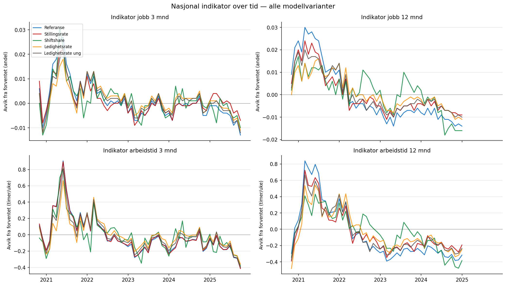
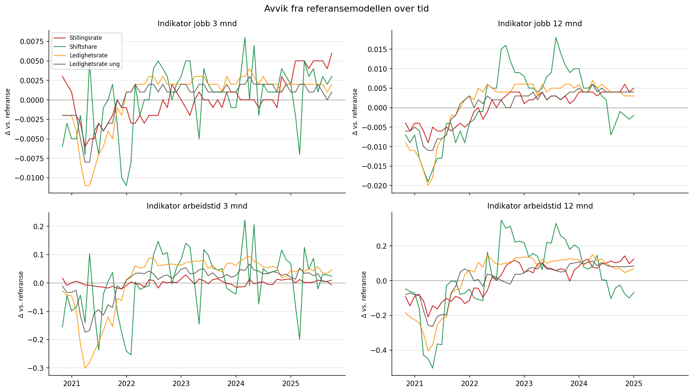
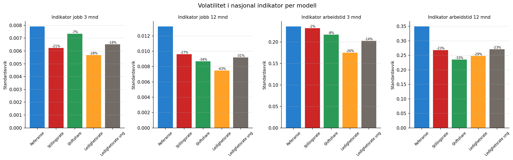

```{python}
import pandas as pd
```

# Nasjonal tidsserie

@fig-nasj-tid viser indikatorverdiene for alle fem modellvarianter over tid
på nasjonalt nivå. Alle modeller følger det samme overordnede mønsteret,
men med ulik amplitude.

{#fig-nasj-tid}

# Avvik fra referansemodellen

@fig-nasj-delta viser avviket (delta) mellom hver utvidet modell og
referansemodellen over tid. Positive verdier betyr at den utvidede modellen
gir en høyere indikator enn referansen for den aktuelle måneden.

{#fig-nasj-delta}

Avvikene er ikke konstante over tid — de varierer med arbeidsmarkedssyklusen.
Dette er forventet: de utvidede modellene absorberer arbeidsmarkedsvariasjon
som referansemodellen lar stå igjen i indikatoravviket.

# Volatilitet

@fig-volatilitet viser standardavviket i nasjonal indikator per modell. Lavere
volatilitet betyr mer stabile indikatorer over tid.

{#fig-volatilitet}

```{python}
#| label: tbl-volatilitet
#| tbl-cap: "Prosentvis endring i standardavvik vs. referansemodellen"
df_vol = pd.read_csv("tabeller/volatilitet.csv")

utfall_labels = {
    "indikator_jobb3": "Jobb 3 mnd",
    "indikator_jobb12": "Jobb 12 mnd",
    "indikator_atid3": "Atid 3 mnd",
    "indikator_atid12": "Atid 12 mnd",
}

# Beregn prosentendring vs referanse
rows = []
for utfall in df_vol["utfall"].unique():
    sub = df_vol[df_vol["utfall"] == utfall]
    ref_std = sub[sub["modell"] == "Referanse"]["std"].values[0]
    for _, row in sub.iterrows():
        pct = (row["std"] - ref_std) / ref_std * 100
        rows.append({
            "Utfall": utfall_labels.get(utfall, utfall),
            "Modell": row["modell"],
            "Std": f"{row['std']:.5f}",
            "Endring vs. ref.": f"{pct:+.0f} %",
        })
df_tbl = pd.DataFrame(rows)
pivot = df_tbl.pivot(index="Modell", columns="Utfall", values="Endring vs. ref.")
pivot[["Jobb 3 mnd", "Jobb 12 mnd", "Atid 3 mnd", "Atid 12 mnd"]]
```

Alle utvidede modeller gir lavere nasjonal volatilitet enn referansen,
særlig for **jobb 12 mnd** og **arbeidstid 12 mnd**. Ledighetsrate-modellen
gir den største reduksjonen for jobb 12 mnd (−43 %).

::: {.callout-note}
## Tolkning
Lavere volatilitet er *ikke* i seg selv bevis på bedre arbeidsmarkedskontroll.
Det kan også skyldes forskjeller i utvalg eller overføring av variasjon.
Den direkte testen — om korrelasjon med stramhetsmål reduseres — presenteres
i [stramhetstesten](stramhet_sensitivitet.qmd).
:::
