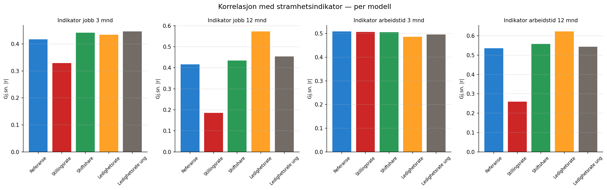
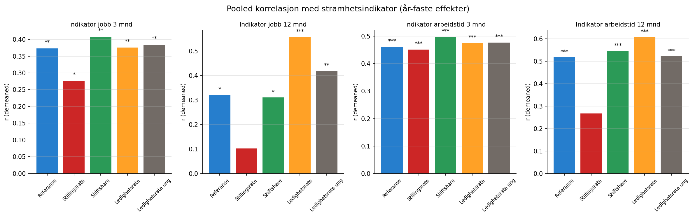

```{python}
import pandas as pd
```

# Motivasjon

Den sentrale testen i denne analysen er: **reduseres sammenhengen mellom
indikatoravvikene og uavhengige mål på arbeidsmarkedsstramhet når vi
utvider modellen med flere arbeidsmarkedsvariabler?**

Dersom den utvidede modellen kontrollerer bedre for arbeidsmarkedet, bør
indikatoravvikene vise *svakere* korrelasjon med stramhetsmålene fra
bedriftsundersøkelsen. Vi bruker samme tilnærming som i
[stramhetsanalysen](../stramhet/intro.qmd), men beregner korrelasjonene
separat for hver modellvariant.

# Krysseksjonelle korrelasjoner per år

For hvert år og hver modell beregner vi Pearson-korrelasjon mellom
regionenes indikatorverdier og stramhetsindikator / andel alvorlige
rekrutteringsproblemer.

```{python}
#| label: tbl-stramhet-korr
#| tbl-cap: "Gjennomsnittlig absolutt korrelasjon med stramhetsindikator per modell"
df = pd.read_csv("../../data/results/modellendringer_stramhet_korrelasjoner.csv")

utfall_labels = {
    "indikator_jobb3": "Jobb 3 mnd",
    "indikator_jobb12": "Jobb 12 mnd",
    "indikator_atid3": "Atid 3 mnd",
    "indikator_atid12": "Atid 12 mnd",
}

# Vis gjennomsnittlig |r| per modell og utfall (stramhetsindikator)
sub = df[df["bedrifts_var"] == "stramhetsindikator"]
rows = []
for utfall in sub["indikator_var"].unique():
    usub = sub[sub["indikator_var"] == utfall]
    for modell in ["Referanse", "Stillingsrate", "Shiftshare", "Ledighetsrate", "Ledighetsrate ung"]:
        msub = usub[usub["modell"] == modell]
        if msub.empty:
            continue
        mean_abs_r = msub["r"].abs().mean()
        ref_r = usub[usub["modell"] == "Referanse"]["r"].abs().mean()
        delta = ref_r - mean_abs_r
        rows.append({
            "Utfall": utfall_labels.get(utfall, utfall),
            "Modell": modell,
            "Gj.sn. |r|": f"{mean_abs_r:.3f}",
            "|r|-reduksjon": f"{delta:+.3f}" if modell != "Referanse" else "—",
        })
pd.DataFrame(rows)
```

# Resultater

{#fig-stramhet-korr}

@fig-stramhet-korr viser den gjennomsnittlige absolutte korrelasjonen mellom
hver modells indikatoravvik og stramhetsindikator.

**Stillingsrate**-modellen skiller seg ut med en markant reduksjon i
korrelasjon med stramhetsmål, særlig for 12-månedersutfallene. For
jobb 12 mnd faller gjennomsnittlig |r| fra 0.42 (referanse) til 0.19
(stillingsrate) — en halvering.

De øvrige modellene (shiftshare, ledighetsrate, ledighetsrate ung) viser
derimot ingen konsistent reduksjon. For ledighetsrate-modellen *øker*
faktisk korrelasjonen for jobb 12 mnd, noe som tyder på at denne
variabelen ikke er ortogonal til stramhetsmålet.

# Pooled korrelasjon med år-faste effekter

{#fig-stramhet-pooled}

```{python}
#| label: tbl-stramhet-pooled
#| tbl-cap: "Pooled korrelasjon med stramhetsindikator, år-faste effekter"
df_pooled = pd.read_csv("../../data/results/modellendringer_stramhet_pooled.csv")
sub = df_pooled[df_pooled["bedrifts_var"] == "stramhetsindikator"]

rows = []
for utfall in sub["indikator_var"].unique():
    for _, row in sub[sub["indikator_var"] == utfall].iterrows():
        sig = "***" if row["p_verdi"] < 0.001 else ("**" if row["p_verdi"] < 0.01 else ("*" if row["p_verdi"] < 0.05 else ""))
        rows.append({
            "Utfall": utfall_labels.get(utfall, utfall),
            "Modell": row["modell"],
            "r (demeaned)": f"{row['r_demeaned']:.4f}",
            "p-verdi": f"{row['p_verdi']:.4f}",
            "Sig.": sig,
        })
pd.DataFrame(rows)
```

@fig-stramhet-pooled viser pooled korrelasjoner etter demeaning. Mønsteret
er det samme: stillingsrate-modellen reduserer korrelasjonen vesentlig,
mens de andre modellene i liten grad endrer den.

# Oppsummering

```{python}
#| label: tbl-sammendrag
#| tbl-cap: "Gjennomsnittlig reduksjon i |r| vs. referansemodellen (positive verdier = lavere korrelasjon)"
df_samm = pd.read_csv("tabeller/stramhet_sammendrag.csv")
pivot = df_samm.pivot(index="modell", columns="indikator_var", values="gj_sn_abs_r_reduksjon")
pivot.columns = [utfall_labels.get(c, c) for c in pivot.columns]
pivot.round(3)
```

Hovedfunn:

1. **Stillingsrate-modellen** gir den mest konsistente reduksjonen i korrelasjon
   med stramhetsmål — positive verdier i alle utfall.
2. **Shiftshare** og **ledighetsrate** gir *økt* korrelasjon for flere utfall,
   noe som tyder på at disse variablene ikke fungerer som tilsiktet kontroll
   mot stramhet.
3. **Ledighetsrate ung** gir blandede resultater.

::: {.callout-important}
## Tolkning
Resultatene tyder på at stillingsrate er den variabelen som best
komplementerer tilstrømming som arbeidsmarkedskontroll. De andre variablene
(shiftshare, ledighetsrate) kan fange opp overlappende variasjon med
tilstrømming uten å tilføre uavhengig informasjon om stramhet.

Det er viktig å bemerke at dette er basert på korrelasjonsanalyse med
et begrenset antall regioner (12) og år (5). Resultatene bør tolkes med
forsiktighet.
:::
