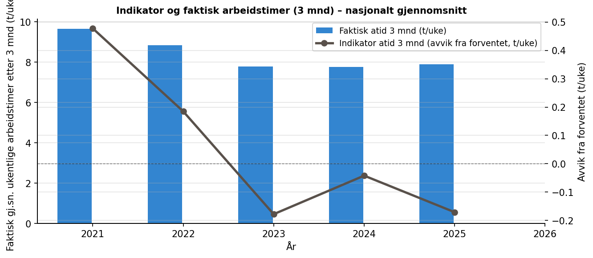
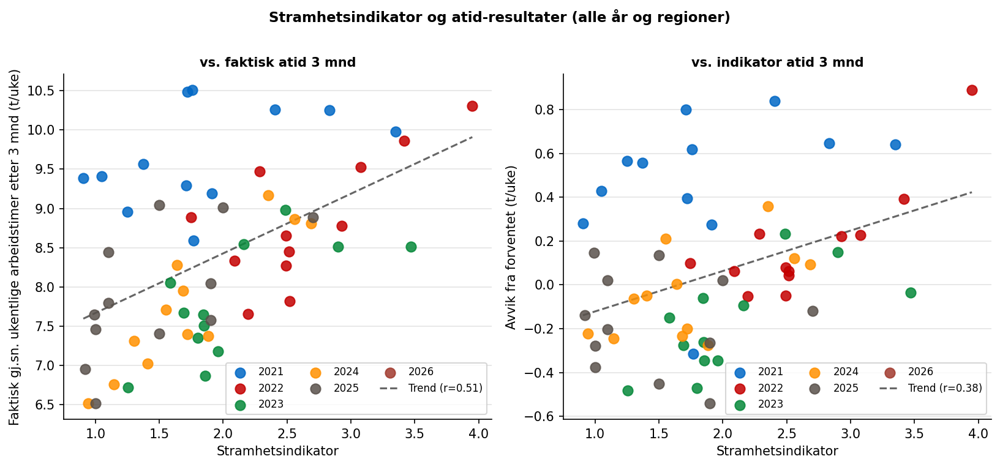
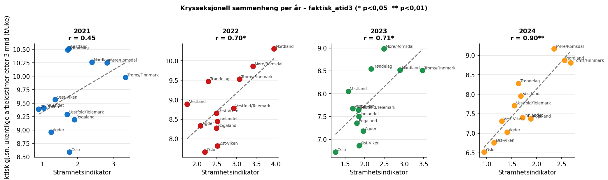
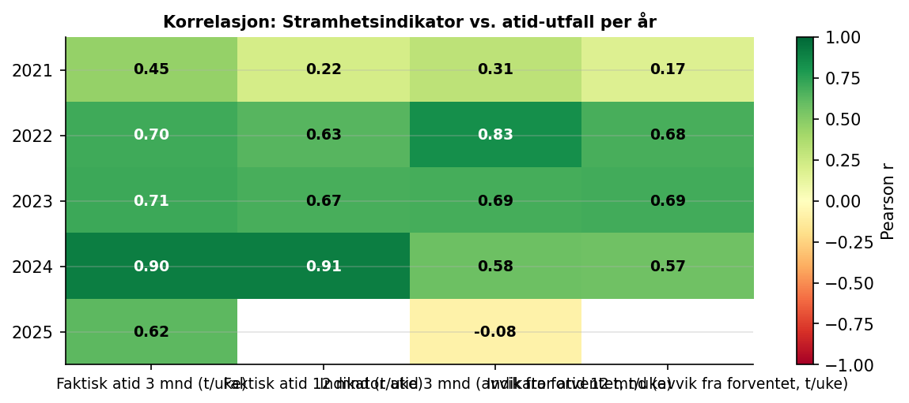
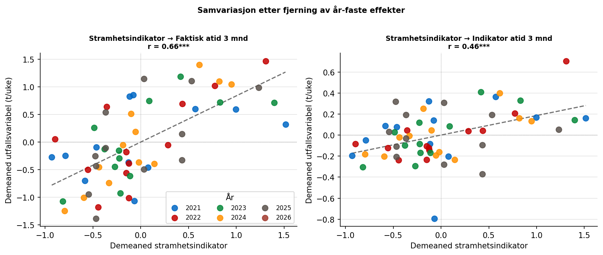

```{python}
import pandas as pd
```

## Data

### NAVs arbeidstidsindikator 2021–2025

Indikatordata er hentet fra NAVs BigQuery-tjeneste og inneholder månedlige
observasjoner per Nav-region. Vi bruker fire utfallsmål for arbeidstid:

| Variabel | Beskrivelse |
|---|---|
| `faktisk_atid3` | Gj.sn. ukentlige arbeidstimer i løpet av 3 mnd etter registrering (t/uke) |
| `faktisk_atid12` | Gj.sn. ukentlige arbeidstimer i løpet av 12 mnd etter registrering (t/uke) |
| `indikator_atid3` | Avvik fra *forventet* atid3 – kontrollerer for sammensetning (t/uke) |
| `indikator_atid12` | Avvik fra *forventet* atid12 (timer/uke) |

: Variabler fra arbeidstidsindikatoren brukt i analysen {#tbl-indvar}

Et positivt `indikator`-tall betyr at regionen gjør det *bedre enn forventet*
gitt sammensetningen av registrerte arbeidssøkere. Dette er det reneste
utfallsmålet for sammenligning mellom regioner, fordi det kontrollerer for
at noen regioner strukturelt sett har en mer krevende søkerpopulasjon.

*Merknad:* `faktisk_atid12` mangler for 2025 fordi 12-månedersutfallet for
arbeidssøkere registrert i mars 2025 ikke vil foreligge før mars 2026.

## Metode

### Korrelasjonsanalyse

Vi analyserer sammenhengen mellom stramhet og arbeidstidsutfall på to måter:

**Krysseksjonell analyse innen hvert år** sammenligner de tolv Nav-regionene
i samme undersøkelsesår. Denne tilnærmingen eliminerer nasjonale
konjunkturbevegelser og isolerer den *regionale* variasjonen i
arbeidsmarkedsstramhet.

**Pooled panel med år-faste effekter** trekker fra årsgjennomsnittet i hver
variabel før korrelasjon beregnes. Det gir et samlet mål på om regioner som
ligger over snittet i stramhet også ligger over snittet i arbeidstid samme år.

## Resultater

### Nasjonal utvikling i arbeidstidsindikator

{#fig-ind-tid}

@fig-ind-tid viser utviklingen i gjennomsnittlig ukentlig arbeidstid 3 måneder
etter registrering, og avviket fra forventet arbeidstid. Mønsteret ligner
jobbindikatoren: sammensetningseffekter kan trekke faktisk arbeidstid i en
annen retning enn stramheten, mens indikatorvariabelen (avvik fra forventet)
gir et renere bilde av om regionene leverer mer eller mindre enn ventet.

### Sammenheng mellom stramhet og arbeidstidsutfall

{#fig-scatter-all}

{#fig-scatter-years}

@fig-scatter-all og @fig-scatter-years viser den positive sammenhengen
mellom stramhetsindikator og faktisk arbeidstid etter 3 måneder. Sammenhengen
er svak i 2021 (r = 0,45) men styrkes markant fra 2022 og utover, med
r = 0,70–0,90 i 2022–2024. Mønsteret er svært likt det som ble funnet
for jobbindikatoren, noe som tyder på at begge utfallsmål fanger opp den
samme underliggende mekanismen: i strammere markeder jobber nyregistrerte
arbeidssøkere mer timer per uke.

### Korrelasjonstabeller

```{python}
#| label: tbl-kor-per-aar
#| tbl-cap: "Pearson r mellom stramhetsindikator og atid-utfall per år (krysseksjonell). * p < 0,05"
pd.read_csv("tabeller/tbl_kor_per_aar.csv").set_index("År").style
```

```{python}
#| label: tbl-kor-pooled
#| tbl-cap: "Pooled Pearson r med år-faste effekter. * p<0,05  ** p<0,01  *** p<0,001"
pd.read_csv("tabeller/tbl_kor_pooled.csv").style.hide(axis="index")
```

{#fig-kor-heat}

@tbl-kor-per-aar viser at stramhetsindikatorens korrelasjon med faktisk
arbeidstid er konsistent positiv og statistisk signifikant fra 2022 og utover.
@tbl-kor-pooled viser at det samme holder i den poolede analysen med år-faste
effekter: stramhetsindikator er signifikant korrelert med `faktisk_atid3`
(r = 0,66, p < 0,001) og `faktisk_atid12` (r = 0,61, p < 0,001), og
indikatoravvikene `indikator_atid3` (r = 0,46, p < 0,001) og
`indikator_atid12` (r = 0,51, p < 0,001) er begge sterkt signifikante.
Sammenhengen for arbeidstid er noe sterkere enn for jobbindikatoravviket.

### Samvariasjon etter fjerning av år-effekter

{#fig-demeaned}

@fig-demeaned bekrefter at sammenhengen holder selv etter at nasjonale
konjunktursykluser er trukket ut: regioner som ligger *over* gjennomsnittet
i stramhet det aktuelle året, tenderer til å ha arbeidssøkere som arbeider
*flere timer per uke* enn gjennomsnittet det samme året.

## Konklusjon

### Hva finner vi?

1. Regioner med høyere stramhet har gjennomgående høyere arbeidstid for
   nyregistrerte arbeidssøkere.
2. Sammenhengen holder også når nasjonale årssvingninger tas ut.
3. Arbeidstidsindikatoren viser gjennomgående et tydeligere stramhetssignal enn
   jobbindikatoren i samme periode.

### Hvor sikre er vi?

Funnene vurderes som **relativt robuste** innenfor tilgjengelig datagrunnlag:
samme retning finnes både i årlige krysseksnitt og pooled analyser.

### Hva betyr det?

Når også indikatoravvik samvarierer med stramhet, tyder det på at modellen ikke
fullt ut fanger arbeidsmarkedstilstanden. Det styrker behovet for å teste
utvidede arbeidsmarkedskontroller i indikatormodellen.
