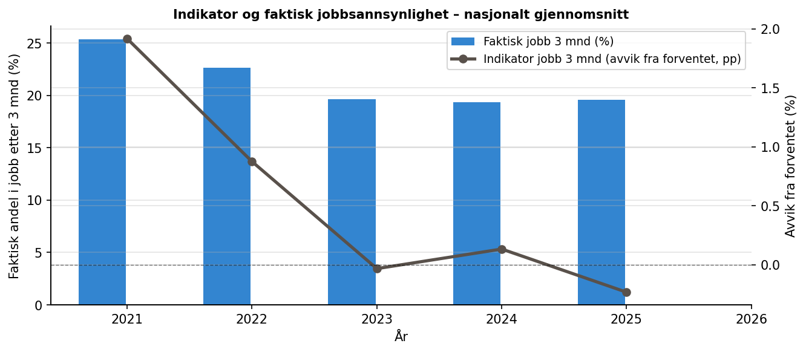
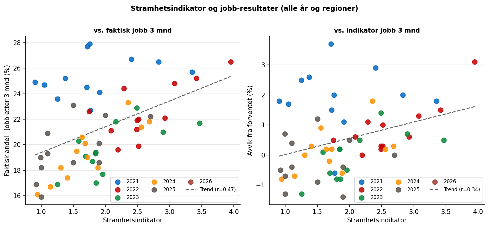
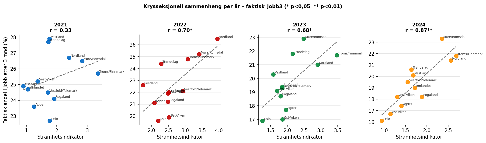
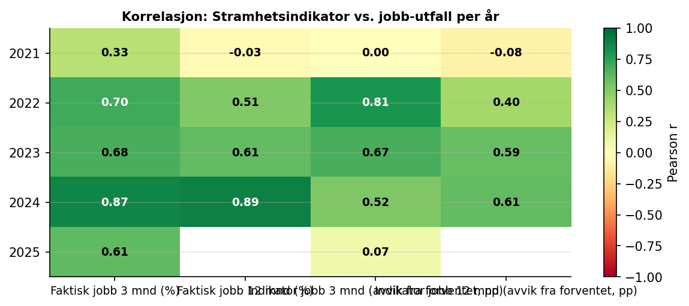
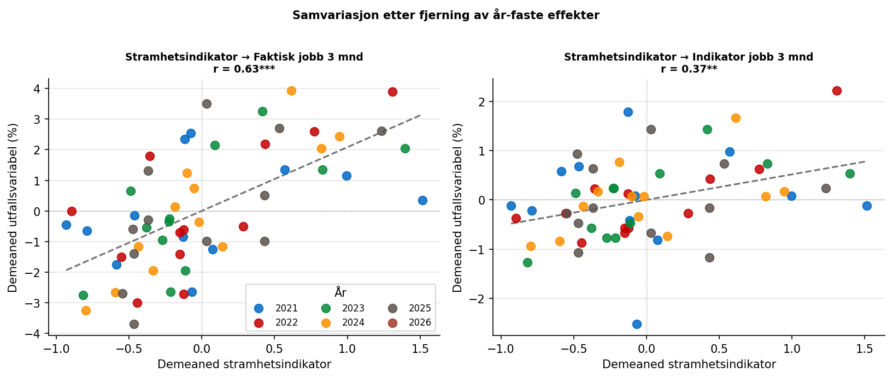

```{python}
import pandas as pd
```

## Data

### NAVs jobbindikator 2021–2025

Indikatordata er hentet fra NAVs BigQuery-tjeneste og inneholder månedlige
observasjoner per Nav-region. Vi bruker fire utfallsmål:

| Variabel | Beskrivelse |
|---|---|
| `faktisk_jobb3` | Andel registrert den aktuelle måneden som var i jobb etter 3 måneder (%) |
| `faktisk_jobb12` | Andel registrert den aktuelle måneden som var i jobb etter 12 måneder (%) |
| `indikator_jobb3` | Avvik fra *forventet* jobb3 – kontrollerer for sammensetning (pp) |
| `indikator_jobb12` | Avvik fra *forventet* jobb12 (prosentpoeng) |

: Variabler fra jobbindikatoren brukt i analysen {#tbl-indvar}

Et positivt `indikator`-tall betyr at regionen gjør det *bedre enn forventet*
gitt sammensetningen av registrerte arbeidssøkere. Dette er det reneste
utfallsmålet for sammenligning mellom regioner, fordi det kontrollerer for
at noen regioner strukturelt sett har en mer krevende søkerpopulasjon.

*Merknad:* `faktisk_jobb12` mangler for 2025 fordi 12-månedersutfallet for
arbeidssøkere registrert i mars 2025 ikke vil foreligge før mars 2026.

## Metode

### Korrelasjonsanalyse

Vi analyserer sammenhengen mellom stramhet og indikatorer på to måter:

**Krysseksjonell analyse innen hvert år** sammenligner de tolv Nav-regionene
i samme undersøkelsesår. Denne tilnærmingen eliminerer nasjonale
konjunkturbevegelser – det at alle regioner stiger og faller simultant –
og isolerer den *regionale* variasjonen i arbeidsmarkedsstramhet.

**Pooled panel med år-faste effekter** trekker fra årsgjennomsnittet i hver
variabel før korrelasjon beregnes. I praksis betyr dette at vi ser på om
regioner som ligger over snittet i stramhet det aktuelle året også ligger over
snittet i indikatorutfall samme år.

## Resultater

### Nasjonal utvikling i jobbindikator

{#fig-ind-tid}

@fig-ind-tid viser at det faktiske jobbresultatet falt markant fra 2021 til
2023 – til tross for at arbeidsmarkedet var stramt. Dette reflekterer
sammensetningseffekter: i 2021 gikk mange koronapermitterte raskt tilbake
til sin opprinnelige arbeidsgiver (og bidrar dermed kunstig høyt til
jobbsannsynligheten), mens de gjenværende registrerte i 2022–2023 utgjorde
en mer krevende gruppe. Det er nettopp derfor *indikatorvariabelen* (avvik
fra forventet) er det reneste sammenligningsmålet.

### Sammenheng mellom stramhet og indikatorutfall

{#fig-scatter-all}

{#fig-scatter-years}

@fig-scatter-all og @fig-scatter-years viser den positive sammenhengen
mellom stramhetsindikator og faktisk jobbplassering. Sammenhengen er svak i
2021 (r = 0,33) men styrkes markant i 2022–2024 der r er 0,70–0,90. En
mulig tolkning er at koronapandemiens ettereffekter forstyrret signalet i
2021 – mange permitterte gikk tilbake til sin opprinnelige arbeidsgiver
uavhengig av regional stramhet.

### Korrelasjonstabeller

```{python}
#| label: tbl-kor-per-aar
#| tbl-cap: "Pearson r mellom stramhetsindikator og indikatorutfall per år (krysseksjonell). * p < 0,05"
pd.read_csv("tabeller/tbl_kor_per_aar.csv").set_index("År").style
```

```{python}
#| label: tbl-kor-pooled
#| tbl-cap: "Pooled Pearson r med år-faste effekter. * p<0,05  ** p<0,01  *** p<0,001"
pd.read_csv("tabeller/tbl_kor_pooled.csv").style.hide(axis="index")
```

{#fig-kor-heat}

@tbl-kor-per-aar viser at stramhetsindikatorens korrelasjon med faktisk
jobbplassering er konsistent positiv og statistisk signifikant fra 2022 og
utover. @tbl-kor-pooled viser at det samme holder i den poolede analysen
med år-faste effekter: stramhetsindikator er signifikant korrelert med
`faktisk_jobb3` (r = 0,63, p < 0,001) og `faktisk_jobb12`
(r = 0,46, p < 0,01) etter at nasjonale trender er fjernet.

### Samvariasjon etter fjerning av år-effekter

{#fig-demeaned}

@fig-demeaned bekrefter at sammenhengen holder selv etter at nasjonale
konjunktursykluser er trukket ut: regioner som ligger *over* gjennomsnittet
i stramhet det aktuelle året, tenderer til å plassere *flere* arbeidssøkere
i jobb enn gjennomsnittet det samme året.

## Konklusjon

### Hva finner vi?

1. Regioner med høyere stramhet har gjennomgående bedre jobbutfall enn regioner
   med lavere stramhet, særlig fra 2022 og utover.
2. Sammenhengen står seg også når nasjonale årssvingninger tas ut.
3. Sammenhengen er svakere i 2021, som skiller seg ut som et pandemiår.

### Hvor sikre er vi?

Funnene i denne delen vurderes som **relativt robuste**: mønsteret går igjen i
både årlige krysseksnitt og pooled analyse med år-faste effekter.

### Hva betyr det?

At også indikatoravvik samvarierer med stramhet, tyder på at arbeidsmarkedet
fortsatt påvirker den delen av indikatoren som skal være renset for
omgivelsesforhold. Resultatene alene avgjør ikke modellvalg, men de peker på
at arbeidsmarkedskontrollen kan styrkes.
